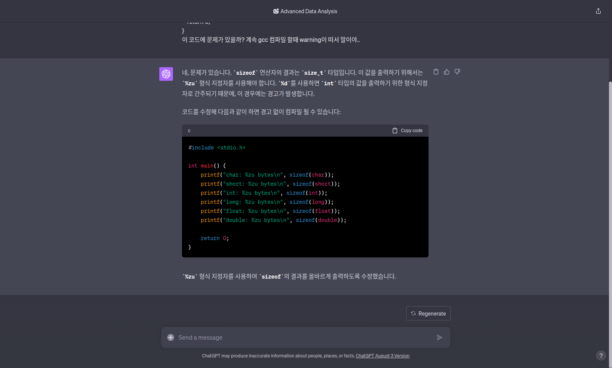

안녕하세요 이번 화이트햇 스쿨 1기 박여웅입니다 :) 전에 내주신 숙제를 했습니다 :) 잘봐주세요!!
# 1. 나의 리눅스 환경 만들기!

저는 리눅스를 메인으로 사용해서 현재 아주 잘 깔아서 사용중입니다. 버전은 Ubuntu 22.04 LTS 입니다.

# 2. Sizeof 연산 타이핑해보기(선택과제)
```c
#include <stdio.h>

int main() {
    printf("char: %zu bytes\n", sizeof(char));
    printf("short: %zu bytes\n", sizeof(short));
    printf("int: %zu bytes\n", sizeof(int));
    printf("long: %zu bytes\n", sizeof(long));
    printf("float: %zu bytes\n", sizeof(float));
    printf("double: %zu bytes\n", sizeof(double));

    return 0;
}
```
일단 최종적으로 코드는 위처럼 구성했어요.

```c
#include <stdio.h>

int main() {
    printf("char: %d bytes\n", sizeof(char));
    printf("short: %d bytes\n", sizeof(short));
    printf("int: %d bytes\n", sizeof(int));
    printf("long: %d bytes\n", sizeof(long));
    printf("float: %d bytes\n", sizeof(float));
    printf("double: %d bytes\n", sizeof(double));

    return 0;
}
```
처음에는 위처럼 작성을 했는데, 계속 gcc로 컴파일 할때마다 warning이 뜨더라구요? 

그래서 GPT 한테 궁금해서 물어봤어요.

위에 사진처럼  sizeof return type은 size_t 라는 특이한 타입을 가지고 있더라고요..?

그래서 %zu라는 형식 지정자가 있다고 해서 %zu를 이용해서 다시 작성했습니다 :)

하지만....

출력값은 같아요 :) 킹치만.. 그래도 warning이 안났으니까 된거겠죠? ㅋㅋㅋㅋ

# 3.  언더플로 구현하기
```c
#include <stdio.h>
#include <limits.h>

int main(){
	char value = CHAR_MIN;

	printf("original value: %d\n", value);
	value = value - 1;
	printf("value after subtracting 1 %d\n", value);

	return 0;
}
```
코드는 위처럼 구성했습니다. 저번에 오프라인 수업때 사용했던 오버플로 코드를 바탕으로 작성했습니다.


정상적으로 최하값에서 -1을 해주니 최상값인 127 값이 나오는것을 확인할수 있었습니다 :)

# 4. 비트 연산 프로그램 바꾸기
## 비트를 끄는 함수 구현하기
```c
#include <stdio.h>

int is_bit_set(unsigned char value, int position) {
    return (value & (1 << position)) != 0;
}

unsigned char set_bit(unsigned char value, int position) {
    return value | (1 << position);
}

unsigned char clear_bit(unsigned char value, int position) {
    return value & ~(1 << position);
}

int main() {
    unsigned char value = 0b00001000;

    if (is_bit_set(value, 3)) {
        printf("3rd bit is set!\n");
    } else {
        printf("3rd bit is not set!\n");
    }

    value = clear_bit(value, 3);
    printf("Value after clearing 3rd bit: %d\n", value);
    
    if (is_bit_set(value, 3)) {
        printf("3rd bit is set!\n");
    } else {
        printf("3rd bit is not set!\n");
    }

    return 0;
}
```
위처럼 코드를 구성했습니다. 저번 오프라인 수업때 사용했던 코드를 활용해 작성했습니다.


위처럼 비트값이 존재했다가 비트값을 끄고 비트값이 1에서 0이 되는 모습을 볼 수 있습니다.

## input을 이용한 비트 연산(선택과제)
```c
#include <stdio.h>

int is_bit_set(unsigned int value, int position) {
    return (value & (1 << position)) != 0;
}

unsigned int clear_bit(unsigned int value, int position) {
    return value & ~(1 << position);
}

int main() {
    unsigned int value;

    printf("Enter an integer: ");
    scanf("%u", &value);

    if (is_bit_set(value, 3)) {
        printf("3rd bit is set!\n");
        value = clear_bit(value, 3);
        printf("Value after clearing 3rd bit: %u\n", value);
    } else {
        printf("3rd bit is already not set!\n");
    }

    return 0;
}
```
위처럼 저는 구성을 했습니다. 이또한 전에 사용했던 코드를 활용해서 작성했습니다.


사용자가 입력을 보내면 그 입력값에서 3번째 비트가 켜져있다면 끄게 만들어 주게 됩니다 :)

# 5. C 언어가 기계어로 변하는 과정

간단하게 hello world! 를 출력하는 프로그램을 작성해서 각각 단계별 파일을 생성했습니다.

# 전처리 과정 (\*.i)

원래는 전처리 파일에 있는 코드를 넣으려 했는데 생각보다 너무 길어져 이건 아니다 싶어 안 넣었습니다.


일단 저는 cat으로 보는게 익숙해서 이렇게 cat을 이용해서 파일내용을 보았습니다. 보면서 아직은 전처리 단계라 그런지 C언어의 형태가 대부분 살아 있는것처럼 보여서 신기했습니다 :)

## 컴파일 과정 (\*.s)
```s
	.file	"hello_world.c"
	.text
	.section	.rodata
.LC0:
	.string	"hello, world!"
	.text
	.globl	main
	.type	main, @function
main:
.LFB0:
	.cfi_startproc
	endbr64
	pushq	%rbp
	.cfi_def_cfa_offset 16
	.cfi_offset 6, -16
	movq	%rsp, %rbp
	.cfi_def_cfa_register 6
	leaq	.LC0(%rip), %rax
	movq	%rax, %rdi
	call	puts@PLT
	movl	$0, %eax
	popq	%rbp
	.cfi_def_cfa 7, 8
	ret
	.cfi_endproc
.LFE0:
	.size	main, .-main
	.ident	"GCC: (Ubuntu 11.4.0-1ubuntu1~22.04) 11.4.0"
	.section	.note.GNU-stack,"",@progbits
	.section	.note.gnu.property,"a"
	.align 8
	.long	1f - 0f
	.long	4f - 1f
	.long	5
0:
	.string	"GNU"
1:
	.align 8
	.long	0xc0000002
	.long	3f - 2f
2:
	.long	0x3
3:
	.align 8
4:
```
확실히 컴파일 과정을 거치니 점점 어셈블리어로 변하는게 확실히 눈에 보였습니다. 어셈처럼 변하니까

전처리 과정에서 나온 \*.i 파일의 코드에서 훨씬 간결해졌습니다 :)

## 어셈블 과정(\*.o)


확실히 이젠 기계어가 되어서 사람이 일반 텍스트 에디터로는 읽지 못하는것을 알게 되었습니다 ~~ㅠㅠ~~

그럼 이번엔 제가 많이 사용하는 GDB-peda를 이용해 디버깅을 통해 읽어보겠습니다.

이런식으로 GDB-peda를 이용해 디버깅을 해주면 Disassembly 되어 어셈으로 편하게 볼 수 있습니다.

~~근데 분명히 printf로 했는데 왜 puts로 들어갔을까요..? 이걸 잘 모르겠습니다..~~

# 마지막
이렇게 숙제를 다 끝냈습니다!! 시간이 없으니까 빨리 제출해야겠네요 ㅎㅎ 

재밌고 알찬 수업 진행 해주셔서 감사합니다 멘토님 :)

__made by ZEROCOKE__